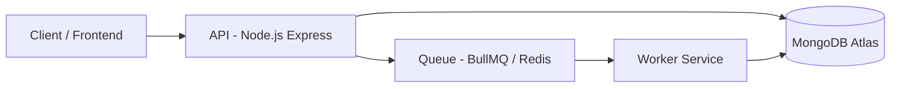

# QueueForge — Distributed Job Processing System

QueueForge is a distributed asynchronous job processing system built with Node.js, BullMQ, Redis, MongoDB, and Docker to simulate production-style backend execution pipelines with retries, lifecycle tracking, fault tolerance, and worker-based processing.

The system demonstrates queue-driven architecture, distributed workers, concurrency handling, retry strategies, and real-world asynchronous processing patterns.

---

## Features

- Asynchronous job processing using Redis-backed queues (BullMQ)
- Distributed worker architecture with separated API and worker services
- Retry mechanism with exponential backoff
- Failure classification (retryable vs permanent errors)
- Persistent job lifecycle tracking using MongoDB
- Real-time job status tracking via API
- Real report-processing workload (row profiling + checksum generation)
- Rate limiting to protect API behavior under burst traffic
- Dockerized multi-service deployment
- Production-ready environment configuration

---

## System Flow

```text
Client
   ↓
Express API
   ↓
Redis Queue (BullMQ)
   ↓
Worker Service
   ↓
MongoDB Persistence
```



---

## Architecture

- API handles job creation and status queries
- Jobs are pushed into Redis-backed BullMQ queues
- Worker services process jobs asynchronously
- MongoDB persists job lifecycle state and execution results
- Queue-driven decoupling allows API responsiveness during burst traffic

---

## Tech Stack

- Backend: Node.js, Express
- Queue System: BullMQ, Redis
- Database: MongoDB Atlas
- Frontend: React (Vite)
- Infrastructure: Docker, Docker Compose
- Deployment: AWS EC2

---

## Project Structure

```text
backend/
frontend/
docker-compose.yml
docs/
```

---

## Job Lifecycle

```text
WAITING → ACTIVE → COMPLETED / FAILED
```

- `WAITING` → Job is queued
- `ACTIVE` → Job is currently processing
- `COMPLETED` → Job finished successfully
- `FAILED` → Job failed after retries or due to permanent error

---

## Retry & Failure Handling

- Exponential backoff retry strategy
- Configurable retry attempts
- Failure classification:
  - Retryable errors → retried automatically
  - Permanent errors → fail immediately

### Terminal Failure States

- `MAX_RETRIES_REACHED`
- `PERMANENT_ERROR`

---

## Run with Docker

```bash
git clone https://github.com/ManasBhardwaj07/QueueForge.git
cd QueueForge
docker-compose up --build
```

> `docker compose` (v2) is preferred when available.

### MongoDB Deployment Mode

- Production/demo deployment uses MongoDB Atlas via `MONGO_URI`
- The `mongo` service in `docker-compose.yml` is intended only for local development fallback

---

## Concurrency Validation

Live burst test performed on AWS EC2 deployment (April 2026):

- Submitted: 10 report jobs back-to-back
- Terminal states reached: 10/10
- Completed: 10
- Failed: 0
- Total time to terminal states: 19 seconds

### Observed Behavior Under Burst Traffic

- API immediately accepts jobs and returns `WAITING`
- Worker transitions jobs through `ACTIVE` to terminal states
- Retryable failures re-enter `WAITING` with exponential backoff
- Attempt counters persist across retries
- Terminal failures persist `finalFailureReason` for postmortem analysis

This demonstrates queue-driven decoupling and stable asynchronous behavior under short traffic spikes.

---

## Live Demo

Frontend:
```text
http://13.60.71.27:3001
```

API Health Endpoint:
```text
http://13.60.71.27:5000/health
```

---

## UI Screenshots

### Dashboard Overview


### Create Job


### Track Job Status


### Result Review


---

## Environment Variables

```env
MONGO_URI=
REDIS_HOST=
PORT=
```

---

## Why This Project?

QueueForge focuses on production-oriented backend system design concepts including:

- asynchronous processing
- queue-driven architecture
- distributed workers
- retry & failure recovery strategies
- API/worker separation
- concurrency handling
- Dockerized deployment
- infrastructure-oriented backend engineering

---

## Summary

QueueForge demonstrates:

- distributed asynchronous processing
- Redis-backed queue systems
- worker-based execution pipelines
- lifecycle tracking & persistence
- retry and fault-tolerant execution
- Dockerized backend infrastructure
- production-style backend architecture
